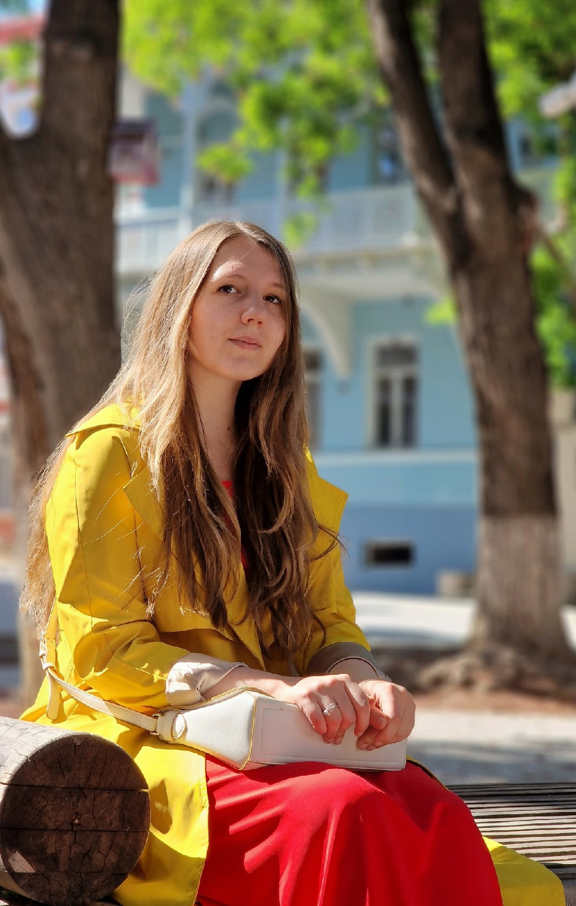

# [rsschool-cv]("https://app.rs.school")
# Tatiana Untilova


## Contacts
* Location: Tbilisi, Georgia
* Phone: +995 511107986
* Email: tatiana.tss.untilova@gmail.com
* GitHub: [TanyaTss]("https://github.com/TanyaTss")
* Discord: Tanya_tsss#3085

## About Me
Since October 2021, I have been studying different areas in the IT field to find the most suitable one for me. I started with the basics of C++, tried Dart with the Flutter framework, and now I'm glad to be able to learn the basics of JS at RSSchool. I am ready to learn, understand and gain new skills for my future job

## Skills
* HTML
* CSS
* C++ (basic knowledge)
* JavaScript (fundamentals)

## Code example
```
function multiply(a, b){
 return a * b;
}
let result = multiply(1, 1);
console.log( result );
```
## Education and courses
* Voronezh State Agricultural University
* [WEB development for beginners: HTML and CSS]("https://stepik.org/cert/1677218")

## Language
* Russian - native
* English - B1
